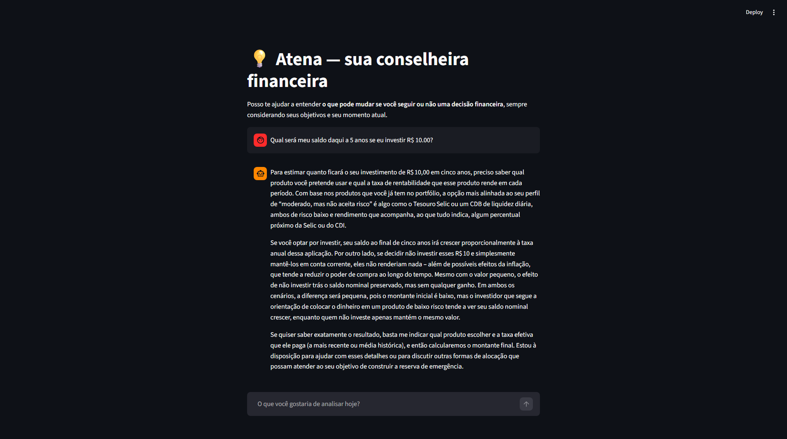
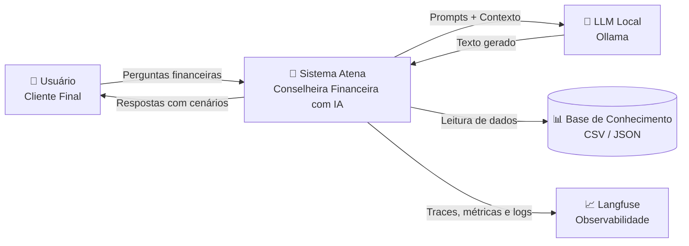

# 🤖 Atena — Conselheira Financeira com IA Generativa

<p align="left">
  
  
  
</p>


A **Atena** é um protótipo de agente financeiro inteligente que utiliza **IA Generativa** para apoiar usuários na tomada de decisões financeiras de forma **consciente, contextualizada e responsável**.




Diferente de chatbots tradicionais, a Atena atua como uma **conselheira consultiva**, apresentando **cenários comparativos (“seguir” vs. “não seguir”)**, respeitando o perfil do usuário, suas metas e limitações — sem impor decisões ou prometer resultados.

Este repositório reúne **documentação conceitual, base de conhecimento mockada, aplicação funcional, prompts e métricas**, servindo como estudo de caso de **IA aplicada ao domínio financeiro**.

---

## ✨ Objetivos do Projeto

- Demonstrar o uso de **IA Generativa como apoio à decisão**, não como agente prescritivo
- Aplicar práticas de **segurança, anti-alucinação e responsabilidade**
- Utilizar **engenharia de prompts orientada a cenários**
- Integrar **base de conhecimento estruturada** (CSV / JSON)
- Avaliar qualidade e desempenho com **métricas e observabilidade (Langfuse)**

---
## 🧠 O que é a Atena?

A Atena é uma agente financeira assistente com personalidade:

- Consultiva e educativa  
- Empática e acessível  
- Analítica e responsável  

Ela ajuda o usuário a:
- Organizar finanças pessoais  
- Avaliar impactos futuros de decisões  
- Entender riscos e benefícios antes de agir  
- Acompanhar metas financeiras  

Sempre utilizando **exclusivamente os dados fornecidos**, declarando limitações quando necessário.

---

## 🏗️ Visão Geral da Arquitetura (C4 – Nível Sistema)

A Atena foi projetada como um **sistema de apoio à decisão financeira**, no qual o modelo de linguagem é apenas um componente controlado do fluxo, e não o decisor final.




### Componentes Principais

| Componente | Responsabilidade |
|-----------|-----------------|
| **Interface Conversacional** | Interação com usuário via Streamlit |
| **Motor de Contexto** | Montagem dinâmica de dados relevantes |
| **LLM (Atena)** | Geração de respostas consultivas |
| **Base de Conhecimento** | Perfil, histórico, transações e produtos |
| **Motor de Regras** | Validação e conformidade |
| **Gerador de Cenários** | Comparações "seguir" vs. "não seguir" |
| **Camada de Segurança** | Anti-alucinação e validações |

> 📌 **Detalhamento completo**: [`docs/01-documentacao-agente.md`](docs/01-documentacao-agente.md)

---

## 📁 Estrutura do Projeto

```
├── 📂 src/
│   ├── app.py                 # Aplicação principal (Streamlit)
│   ├── observability.py       # Integração com Langfuse
│   └── requirements.txt       # Dependências
│
├── 📂 data/                   # Base de conhecimento mockada
│   ├── perfil_investidor.json
│   ├── historico_conversas.csv
│   ├── transacoes.csv
│   └── produtos_financeiros.json
│
├── 📂 docs/                   # Documentação técnica
│   ├── 01-documentacao-agente.md
│   ├── 02-base-conhecimento.md
│   ├── 03-prompts.md
│   └── 04-metricas.md
│
└── README.md
```

### Descrição dos Arquivos Principais

**`app.py`**
- Interface conversacional
- Integração com LLM
- Montagem de contexto
- Fluxo completo de interação

**`observability.py`**
- Tracing com Langfuse
- Métricas de latência e tokens
- Monitoramento de custos
- Registro de metadados

---

## ⚡ Como Executar

### Pré-requisitos

- Python 3.9+
- Conta no Ollama Cloud (para uso de modelos cloud)
- Conta no Langfuse (opcional, para observabilidade)

### 1️⃣ Setup do Ollama (Cloud)

Este projeto utiliza Ollama Cloud Models, que não exigem GPU local.

1. Crie uma conta em:
👉 [https://ollama.com](https://ollama.com)

2. Gere uma API Key no painel do Ollama.
ℹ️ Não é necessário rodar ollama run localmente quando usando Ollama Cloud.


> **Modelos Suportados**
>  Modelo padrão configurado:
>  ```text
> gpt-oss:20b-cloud
> ```
> O projeto pode ser adaptado para outros modelos do Ollama Cloud alterando apenas o `.env`.

### 2️⃣ Instalação do Projeto

```bash
# Clonar o repositório
git clone https://github.com/Jezebel1990/athena-financial-advisor-ai.git
cd athena-financial-advisor-ai

# Criar ambiente virtual (recomendado)
python -m venv venv
source venv/bin/activate  # Linux/Mac
# ou
venv\Scripts\activate     # Windows

# Instalar dependências
pip install -r requirements.txt
```

### 3️⃣ Configuração das Variáveis de Ambiente

O projeto utiliza um arquivo `.env` para configurar o acesso ao **Ollama Cloud** e ao **Langfuse** (observabilidade).

1. Crie o arquivo `.env` a partir do exemplo:

```bash
cp .env.example .env
```

2. Abra o arquivo `.env` e preencha com suas credenciais:
- Chaves do Langfuse (monitoramento e observabilidade)
- API Key do Ollama Cloud
- Modelo LLM desejado

> ⚠️ **Importante**
> O arquivo `.env` não deve ser versionado. Certifique-se de que ele está listado no `.gitignore`.

### 4️⃣ Execução da Aplicação

```bash
 python -m streamlit run src/app.py
```
Após executar o comando, a aplicação será aberta automaticamente em:

```arduino
 http://localhost:8501
```


### 5️⃣ Observabilidade (Langfuse)

Com o Langfuse configurado, o projeto passa a monitorar:
- Tempo de resposta e latência
- Uso estimado de tokens
- Erros do modelo
- Histórico de interações do agente

Isso permite:
- Evolução contínua do agente
- Análise de qualidade das respostas
- Maior confiabilidade em produção


---

## 📚 Documentação

A documentação está organizada em módulos independentes:

| Documento | Conteúdo |
|-----------|----------|
| [`01-documentacao-agente.md`](docs/01-documentacao-agente.md) | Problema, solução, persona, arquitetura e segurança |
| [`02-base-conhecimento.md`](docs/02-base-conhecimento.md) | Estrutura de dados, perfil, metas e contexto |
| [`03-prompts.md`](docs/03-prompts.md) | System prompts, regras e exemplos de interação |
| [`04-metricas.md`](docs/04-metricas.md) | Avaliação, testes, feedback e aprendizados |

---

## 🛠️ Tecnologias

### Core

- **Python** - Linguagem principal
- **Streamlit** - Interface conversacional
- **Ollama** - Runtime de LLM local
- **Langfuse** - Observabilidade e tracing

### Dados

- **CSV/JSON** - Base de conhecimento estruturada
- **Pandas** - Manipulação de dados

### Diagramação

- **Mermaid** - Diagramas como código

---

## 📊 Observabilidade

A aplicação é totalmente instrumentada com **Langfuse**, permitindo:

| Métrica | Descrição |
|---------|-----------|
| 🔍 **Tracing** | Rastreamento completo de interações |
| ⏱️ **Latência** | Tempo de resposta por componente |
| 🎯 **Tokens** | Consumo de tokens por requisição |
| 💰 **Custos** | Estimativa de custos operacionais |
| 🛡️ **Auditoria** | Registro de comportamento do agente |

> 📌 **Detalhes**: [`docs/04-metricas.md`](docs/04-metricas.md)

---

## 🎤 Pitch

Por se tratar de um projeto baseado em **Inteligência Artificial Generativa**, o pitch da solução também foi desenvolvido de forma alinhada ao conceito do projeto.

O roteiro do pitch foi criado a partir de **prompts estruturados** no aplicativo **HeyGen**, permitindo que a própria agente **Atena** apresente o problema, a solução, a demonstração e o impacto do projeto de forma clara e objetiva.

🎬 **Vídeo do Pitch:**  
[](https://youtube.com/shorts/2ldXk8eBRsQ)

O vídeo apresenta:
- O problema enfrentado por pessoas na tomada de decisões financeiras
- Como a Atena utiliza dados do cliente para análise contextualizada
- A demonstração da interface e da interação com o agente
- O diferencial do uso de IA com foco em educação financeira e impacto social

--- 
## ⚖️ Aviso Legal

> ⚠️ **Este projeto é educacional e demonstrativo.**
> 
> A Atena **NÃO substitui consultoria financeira profissional**.
> 
> Todas as respostas são baseadas em dados mockados e não devem ser utilizadas para decisões financeiras reais.

---

## 📄 Licença

Este projeto é disponibilizado apenas para fins educacionais e demonstrativos.

---

## 👤 Autora
Feito com ❤️ por [Jezebel Guedes](https://www.linkedin.com/in/jezebel-guedes/) 👋Vamos nos conectar!
