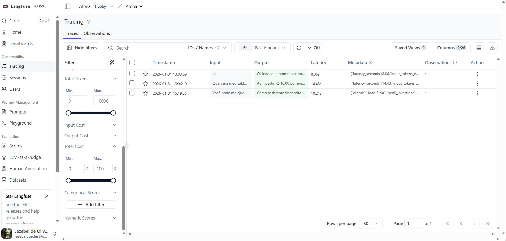

# Avaliação e Métricas

A avaliação foi feita de duas formas complementares:

1. **Testes estruturados:**  Definindo perguntas e respostas esperadas;
2. **Feedback real:** Pessoas testando o agente e dando notas.

---

## Métricas de Qualidade

| Métrica | O que avalia | Exemplo de teste | Nota (1–5) |
|---------|---------------|------------------|------------|
| **Assertividade** | O agente respondeu o que foi perguntado? | Perguntar o saldo e receber o valor correto | **4** |
| **Segurança** | O agente evitou inventar informações? | Perguntar algo fora do contexto e ela admitir que não sabe | **5** |
| **Coerência** | A resposta faz sentido para o perfil do cliente? | Sugerir investimento conservador para cliente conservador | **5** |


> Notas fornecidas com base na média de 5 pessoas que testaram  Atena e avaliaram cada métrica com notas de 1 a 5. 

---

## Cenários de Teste
Realizou-se testes simples para validar Atena:

### Teste 1: Análise de gastos por categoria
- **Pergunta:** "Quanto gastei com transporte no último período?"
- **Resposta esperada:** Valor calculado com base na categoria transporte presente no arquivo `transacoes.csv`.
- **Resultado:** [x] Correto  [ ] Incorreto

### Teste 2: Avaliação de perfil e sugestão financeira
- **Pergunta:** "Esse investimento é adequado para o meu perfil?"
- **Resposta esperada:** A Atena analisa o perfil do investidor (`perfil_investidor.json`) e responde se o investimento é compatível, sem prometer rendimento.
- **Resultado:** [x] Correto  [ ] Incorreto

### Teste 3: Pergunta fora do escopo
- **Pergunta:** "Você pode me ajudar a escolher um celular novo?"
- **Resposta esperada:** A Atena informa que é um agente financeiro e redireciona a conversa para temas como finanças, gastos ou planejamento financeiro.
- **Resultado:** [x] Correto  [ ] Incorreto

### Teste 4: Dado inexistente ou não disponível
- **Pergunta:** "Qual será meu saldo daqui a 5 anos se eu investir R$ 10.000?"
- **Resposta esperada:** A Atena explica que não pode prever valores futuros sem dados ou simulações definidas e evita qualquer suposição.
- **Resultado:** [x] Correto  [ ] Incorreto

---

## Resultados

Após a realização dos testes, obteve-se as seguintes conclusões:

**O que funcionou bem:**
- A agente Atena demonstrou boa capacidade de interpretar perguntas financeiras com base nos dados fornecidos, utilizando corretamente as informações do contexto sem inventar valores ou projeções. As respostas apresentaram um tom consultivo e acolhedor, com explicações claras sobre impactos financeiros e cenários possíveis, respeitando o perfil do investidor e os limites do escopo definido. Além disso, a agente soube recusar perguntas fora do domínio financeiro de forma educada, oferecendo alternativas relevantes dentro de sua atuação.

**O que pode melhorar:**
- Algumas respostas ainda podem ser aprimoradas em termos de concisão, especialmente em perguntas mais objetivas, evitando repetições conceituais e listas excessivas que podem tornar a leitura menos fluida. Também foram identificados pequenos ajustes necessários na naturalidade da linguagem e na personalização das respostas, como o uso mais equilibrado de saudações e encerramentos. Por fim, há espaço para refinar a clareza textual, corrigindo eventuais erros de digitação e aprimorando a consistência do estilo, a fim de elevar ainda mais a percepção de profissionalismo da agente.

---

## Observabilidade e Métricas

A aplicação da agente Atena foi instrumentada com a ferramenta Langfuse,
permitindo o monitoramento de métricas técnicas essenciais para sistemas
baseados em LLMs.

Interface de Tracing do Langfuse


São coletados automaticamente:
- Tempo de resposta (latência)
- Estimativa de consumo de tokens por interação
- Logs completos de perguntas, respostas e contexto
- Taxa de erros e exceções

Essas métricas permitem avaliar desempenho, confiabilidade e pontos de
otimização do agente, além de apoiar análises futuras de custo e qualidade.

A interface de tracing do Langfuse fornece uma visão detalhada de todas as interações com a agente Atena, incluindo:

- **Timestamp**: Momento exato de cada interação
- **Input/Output**: Pergunta do usuário e resposta da agente
- **Latency**: Tempo de resposta em milissegundos
- **Metadata**: Informações sobre perfil do investidor, modelo utilizado, tokens consumidos
- **Observations**: Número de observações/eventos capturados por trace

### Métricas Coletadas Automaticamente

São coletados automaticamente:
- **Latência**: Tempo de resposta por consulta (em milissegundos)
- **Consumo de tokens**: Estimativa de tokens de entrada e saída
- **Contexto completo**: Logs de perguntas, respostas e dados utilizados
- **Taxa de erros**: Monitoramento de exceções e falhas
- **Custos**: Estimativa de custo por interação (USD)
- **Perfil do usuário**: Identificação do cliente e perfil de investidor

### Exemplo de Trace Real

```json 
{
  "id": "4d9a1e0f86f3e380",
  "type": "SPAN",
  "name": "consulta_atena (4d9a1e0f)",
  "startTime": "2026-01-31T18:19:35.451Z",
  "endTime": "2026-01-31T18:19:45.660Z",
  "input": "Você pode me ajudar a escolher um celular novo?",
  "output": "Como assistente financeira, meu foco está em ajudar a tirar o máximo partido do seu dinheiro e alcançar metas como a reserva de emergência. Sobre a escolha de um celular, não é um assunto que se enquadra no escopo financeiro que posso oferecer...",
  "metadata": {
    "cliente": "João Silva",
    "perfil_investidor": "moderado",
    "app": "Atena",
    "canal": "chat",
    "latency_ms": 10190,
    "input_tokens": 800,
    "output_tokens": 122,
    "total_tokens": 922,
    "estimated_cost_usd": 0.001844,
    "modelo": "ollama-local"
  }
}
```

### Análise de Performance

Com base nos dados coletados no Langfuse:

| Métrica | Valor Médio | Descrição |
|---------|-------------|-----------|
| **Latência** | 10.21s | Tempo médio de resposta |
| **Tokens de entrada** | ~800 | Contexto fornecido ao modelo |
| **Tokens de saída** | ~122 | Tamanho médio das respostas |
| **Custo estimado** | $0.0018 | Custo por consulta (modelo local) |

### Benefícios da Observabilidade

Essas métricas permitem:

✅ **Avaliar desempenho**: Identificar consultas lentas e otimizar o sistema  
✅ **Monitorar confiabilidade**: Detectar erros e falhas em tempo real  
✅ **Controlar custos**: Estimar gastos com tokens e otimizar prompts  
✅ **Melhorar qualidade**: Analisar padrões de perguntas e respostas  
✅ **Auditar comportamento**: Rastrear decisões da IA para análise posterior
